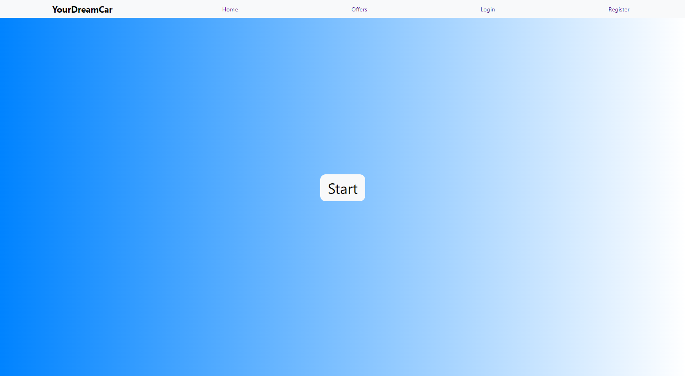
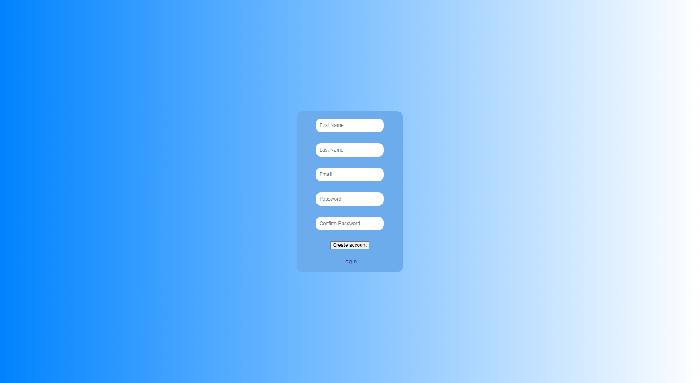
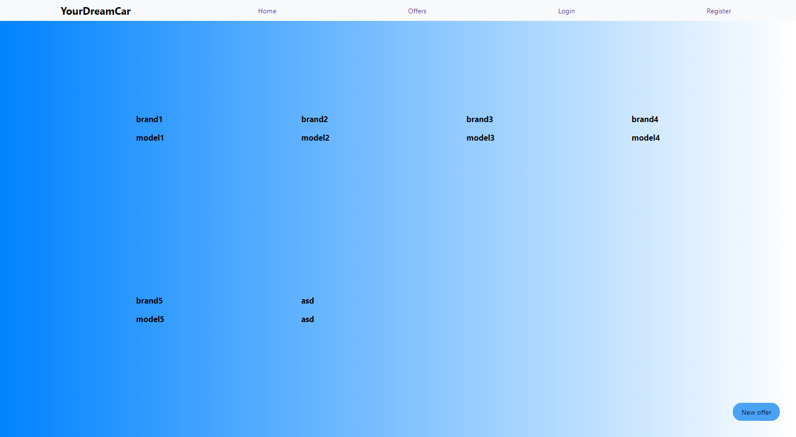

## Opis
Aplikacja skupiająca osoby, które chcą wypożyczyć samochód, użytkownicy niezalogowani mogą przeglądać oferty samochodów dostępnych do wypożyczenia, Po zarejestrowaniu się można dodawać własne ogłoszenia.

## Zastosowane technologie
- Frontend: React
- Backend: Django

## Uruchamianie
- Sklonuj repozytorium z GitHuba do folderu za pomocą git: git clone https://github.com/S1mon1/Application-Project-2
- Przejdź do folderu w git \djangoproject i uruchom backend za pomocą polecenia: python manage.py runserver
- Przejdź do folderu reactapp \djangoproject\reactapp i uruchom frontend za pomocą polecenia: npm start

## Wygląd aplikacji

